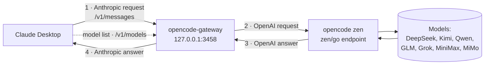

# opencode-gateway

opencode-gateway connects Claude Desktop to the models on your opencode
subscription. Claude Desktop speaks the Anthropic API. opencode speaks the
OpenAI API. The gateway changes one API into the other. The gateway is one
program. It has no runtime dependencies.

<p align="center">

</p>


## How it works

Claude Desktop sends each request in the Anthropic format. The gateway changes
the request into the OpenAI format. The gateway sends the request to opencode.
opencode returns an answer. The gateway changes the answer back into the
Anthropic format. The gateway sends the answer to Claude Desktop.



The gateway does three jobs:

1. It gives the model list at `/v1/models`. Claude Desktop reads this list.
2. It changes the text, images, tool calls, and reasoning between the two formats.
3. It sends the answer back in the Anthropic format, streamed or complete.

## Requirements

- Claude Desktop.
- An opencode subscription with an API key.
- Go 1.26 or later. You need Go only to build the program.

## Build

Use one build script.

On Linux or WSL:

```bash
./build.sh
```

On Windows:

```powershell
.\build.ps1
```

Each script makes two files:

- `opencode-gateway` — the program for Linux.
- `opencode-gateway.exe` — the tray program for Windows.

To build and copy the Windows program to the install folder, add `deploy`:

```bash
./build.sh deploy
```

## Run

The gateway needs your opencode API key. It looks for the key in this order:

1. The environment variable `OPENCODE_API_KEY`.
2. The file in the environment variable `OPENCODE_KEY_FILE`.
3. The opencode key store at `~/.local/share/opencode/auth.json`.
4. The file `opencode-key.txt` next to the program.
5. The file `~/.claude-code-router/opencode-key.txt`.

opencode keeps the key in its own store. The gateway reads the same key. You do
not need to copy the key.

### Windows (tray program)

1. Double-click `opencode-gateway.exe`.
2. An icon shows in the system tray.
3. Right-click the icon to see the menu. The menu shows:
   - **Pause** — stop the gateway. Click again to start the gateway.
   - **Quit** — stop the gateway and close the program.

To start the program with Windows, put a shortcut in the Startup folder. Press
`Win+R`. Type `shell:startup`. Press Enter. Put the shortcut in the folder.

### Linux or WSL (headless program)

```bash
./opencode-gateway
```

The default port is `3458`. To change the port, set `GATEWAY_PORT`:

```bash
GATEWAY_PORT=3500 ./opencode-gateway
```

## Keys and tokens

There are two different tokens.

**The opencode API key.** This is the real key. The gateway uses this key to
send requests to opencode.

opencode stores this key on your computer. opencode writes the key to the file
`auth.json` in its data folder. The path is `~/.local/share/opencode/auth.json`
on Windows, macOS, and Linux. The gateway reads the key from this same file
automatically. You do not configure the key. You do not copy the key.

When you sign in to opencode again, opencode writes a new key to the file. The
gateway then reads the new key. The gateway and opencode always use the same key.

**The Gateway API key.** This is the token in the Claude Desktop connection
window. Claude Desktop sends this token to the gateway with each request. The
gateway does not check this token. Type any value, for example `x`. This token
is not your opencode key. The Gateway API key gives no access to opencode.

The gateway keeps the two tokens apart. Claude Desktop never sees the opencode
API key. The gateway adds the opencode API key only when it sends the request
to opencode.

## Enable Developer Mode in Claude Desktop

Claude Desktop needs Developer Mode. Developer Mode gives the option to use a
gateway.

**Note:** Do not sign in with an Anthropic account first. Enable Developer Mode
on the sign-in screen.

1. Start Claude Desktop. Do not sign in.
2. Open the application menu.
   - On Windows, click the **☰** menu at the top-left of the sign-in screen.
   - On macOS, use the menu bar at the top of the screen.
3. Click **Help**.
4. Click **Troubleshooting**.
5. Click **Enable Developer Mode**.

## Connect Claude Desktop to the gateway

1. Start the gateway. See [Run](#run).
2. Open the application menu again.
3. Click **Developer**.
4. Click **Configure Third-Party Inference…**. A window opens.
5. Set the fields:

   | Field | Value |
   |---|---|
   | Connection | Gateway |
   | Gateway base URL | `http://127.0.0.1:3458` |
   | Gateway API key | any value, for example `x` |
   | Gateway auth scheme | Bearer |
   | Credential kind | Static API key |
   | Model discovery | On |

6. Click **Apply locally**. The app closes and starts again.
7. On the sign-in screen, choose the option to start in third-party mode.

If the models do not show, close Claude Desktop fully. Start Claude Desktop
again. Claude Desktop reads the model list one time and keeps it. A restart
reads the list again.

To check the connection, click **Help → Troubleshooting → Copy Managed
Configuration Report**. The report shows if the key is valid.

## Models

The gateway gives 11 models. Each model has a name that starts with `claude-`.
Claude Desktop shows a clear label for each model.

| Label | Vision |
|---|---|
| DeepSeek V4 Pro | no |
| DeepSeek V4 Flash | no |
| Kimi K3 | yes |
| Kimi K2.7 Code | yes |
| Qwen3.7 Max | no |
| Qwen3.7 Plus | yes |
| GLM-5 | no |
| GLM-5.2 | no |
| Grok 4.5 | yes |
| MiniMax M3 | yes |
| MiMo v2.5 Pro | no |

The gateway supports text, images, tool calls, reasoning, and streaming. A model
with **Vision** accepts images. All models accept tool calls.

A reasoning model (DeepSeek, Kimi, GLM, and others) thinks before it answers.
opencode sends the thought in a `reasoning_content` field. The gateway shows the
thought as an Anthropic *thinking* block before the answer. The reply does not
look empty while the model thinks.

## Effort levels

The model list advertises the effort levels `low`, `medium`, and `high` for
every model. Claude Desktop then shows its effort picker. The gateway sends the
chosen level to opencode as `reasoning_effort`.

Each model on opencode accepts these three levels. The Anthropic-only levels
`xhigh` and `max` are not advertised. If a client sends one of them, the
gateway maps it to `high`.

## Troubleshooting

| Problem | Action |
|---|---|
| Claude Desktop shows no models | Restart Claude Desktop to read the model list again. |
| The gateway returns 401 | Check that the opencode key is present. See [Run](#run). |
| Only one model shows | Confirm the gateway is the current version. Restart Claude Desktop. |
| The exe does not update | Quit the tray program first. The running program locks the file. |

### Request log

To see each request that Claude Desktop sends, set `GATEWAY_LOG=1` and start
the gateway. The gateway writes `gateway.log` next to the program. Each line
shows the model alias, the real model, stream and effort settings, the upstream
status, and the latency. Set `GATEWAY_LOG` to a full path to choose the log
file location.

On Windows:

```powershell
$env:GATEWAY_LOG = "1"
& "C:\path\to\opencode-gateway.exe"
```
